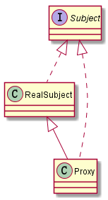
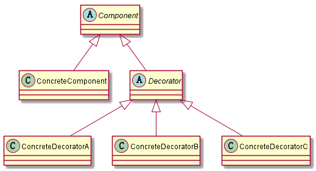
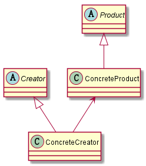
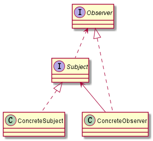

## 适配器模式
包装一个对象，来提供不同的接口  [源码例子](src/adapter)


## 代理模式
包装一个对象，来控制对它的访问（重点学习动态代理涉及反射知识） [源码例子](src/proxy)



定义一个接口

```java
public interface IProgrammer {
       void developeApp();
       void developeWebSite();
       void developeServer();
}
```

真实的对象实现接口的方法

```java
public class RealSubject implements IProgrammer {

	@Override
	public void developeApp() {
		System.out.println("客户需要开发一个包含Android客户端、iPhone客户端的APP");

	}

	@Override
	public void developeWebSite() {
		System.out.println("客户需要开发一个PC端网站");

	}

	@Override
	public void developeServer() {
		System.out.println("客户需要开发一个服务于APP和PC网站的后台");

	}

}

```

假的对象调用真实对象的方法

```java
public class ProgramTestDrive {

	/**
	 * @param args
	 */
	public static void main(String[] args) {
		//被代理类
		RealSubject realSubject = new RealSubject();
		
		Class<?> clazz = realSubject.getClass();
		ClassLoader loader = clazz.getClassLoader();
		
		OwerInvocationHandler handler = new OwerInvocationHandler(realSubject);
		IProgrammer iProgrammer = new ProxySubject().getOwerProxy(loader,
				new Class[] { IProgrammer.class }, handler);
		
		iProgrammer.developeApp();
		iProgrammer.developeWebSite();
		iProgrammer.developeWebSite();
	}

}
```

```java
public class ProxySubject {
    
	/**
	 * 返回一个代理类
	 * @param loader
	 * @param clazz
	 * @param handler
	 * @return
	 */
	public IProgrammer getOwerProxy(ClassLoader loader, Class<?> clazz[],
			InvocationHandler handler) {
		return (IProgrammer) Proxy.newProxyInstance(loader, clazz, handler);
	}
}
```

`Proxy`属于`java.lang.reflect`反射包下的类，传入一个真实对象的ClassLoader，真实对象实现的接口和`java.lang.reflect`包下InvocationHandler的一个子类，得到一个代理的对象，代理对象实现真实对象一样的接口，所以可以调用真实对象实现的接口方法


## 外观模式
包装多个对象，以简化它们的接口 [源码例子](src/facade)


## 装饰者模式
包装另一个对象，并提供额外的行为 [源码例子](src/decorator)




## 命令模式
把请求封装成对象，这可以让你使用不同的请求、队列或日志请求来参数化其他对象 [源码例子](src/command)


## 迭代器模式
提供一种方法顺序访问一个聚合对象中的各个元素，而又不暴露其内部的表示 [源码例子](src/iterator)


## 组合模式
允许你将对象组合成树形结构来表现“整体/部分”的层次结构 [源码例子](src/component)


## 工厂模式
定义了一个创建对象的接口，但由子类决定要实例化的类是哪一个 [源码例子](src/factory)




## 抽象工厂模式
提供一个接口，用于创建相关或依赖对象的家族，而不需要明确指定具体类 [源码例子](src/factory/abstra)


## 观察者模式
定义了对象之间一对多依赖，当一个对象改变状态时，它的所有依赖者都会收到通知并自动更新 [源码例子](src/observer)




## 单例模式
确保一个类只有一个实例，并提供一个全局访问点 [源码例子](src/singleton)


*Note that：单例模式分为饿汉式、懒汉式、Double CheckLock*


## 状态模式
允许对象在内部状态改变时改变它的行为，对象看起来好像修改了它的类 [源码例子](src/state)


## 策略模式
定义了算法族，分别封装起来，让它们之间可以互相代替，让算法的变化独立于使用算法的客户 [源码例子](src/strategy)


## 模板方法模式
在一个方法中定义一个算法的骨架，而将一些步骤延伸到子类中，使得子类在不改变算法结构的情况下，重新定义算法中的某些步骤 [源码例子](src/template)